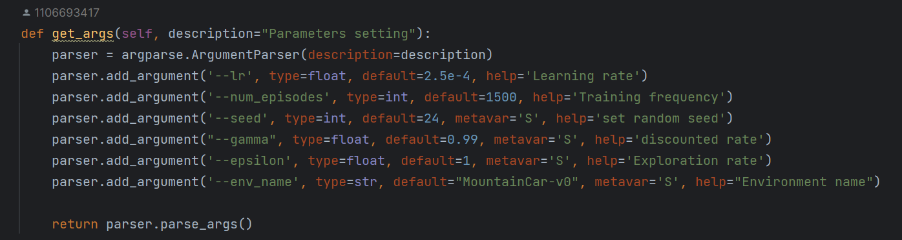

# 实验记录

## DQN+Super网络

### 6.24

#### 通用超参数设置

(注：使用的环境是Atari-Roadrunner，baseline为DQN算法，算法实现代码在Algorithm.py -- DQN_CNN_Super类中)

算法中初始化的超参数:

其中包含了创建`Super_net`对象的代码，`Super_net`同样包含了 超参数设置:

另外，DQN算法的实现中还创建了一个`ReplayBuffer`类的对象，该对象中包含了一个指定环境初始化时随机初始化多少步进行存储并用于经验回放的超参数`learning_starts`以及采用多少个连续帧作为一个状态进行操作的超参数`frame_history_len`:

以上为环境初始化时的超参数

---

进行训练时的超参数设置

训练启动调用的函数:

训练过程的主要代码(train_Roadrunner函数的代码):

训练结果（未完成训练时）：

