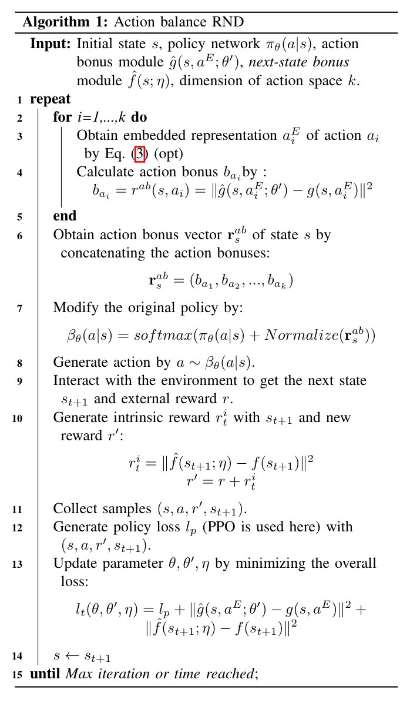

# 笔记

## 摘要

在强化学习中，探索始终是一个关键的问题。在复杂或奖励稀疏的环境中（例如Montezuma's revenge）中进行探索是一个困难的过程，然而基于奖励的方法在探索困难环境中还是取得了一些成功，例如RND算法分配了内在奖励来鼓励智能体访问很少访问的状态。这种奖励是根据执行某个动作后下一个状态的新颖性来得到的，因此我们将这种方法称为下一状态奖励方法。

然而这样的方法使得智能体过度关注探索已知的状态，忽略寻找未知状态。因为探索由已经访问的下一个状态驱动，这会减慢某些环境中探索的速度。

论文中提出了一种方法，用来改善找到未知状态的效率并提出了动作平衡探索，它平衡了在给定状态下选择每个动作的频率，可以看作是置信上界在深度强化学习中的扩展。

> 置信上界（Upper Confidence Bound，简称UCB）是一种用于平衡探索与利用的算法。在强化学习中，UCB算法用于选择动作，以便智能体能够在探索未知动作和利用已知高奖励动作之间找到平衡点。
>
> UCB算法基于置信上界的原理，它通过估计每个动作的奖励值，并计算每个动作的置信上界。置信上界表示对奖励值的不确定性的估计，它越大表示对奖励值的估计越不确定，智能体越有可能选择该动作进行探索。
>
> 具体来说，UCB算法根据每个动作的奖励估计值和置信上界来选择动作。在每个时间步，UCB算法会计算每个动作的置信上界，并选择具有最大置信上界的动作进行执行。这样，智能体既能够利用已知的高奖励动作，又能够在一定概率下选择未知的动作进行探索。
>
> UCB算法的一个常用形式是UCB1算法，它使用上界函数$UCB1(a) = Q(a) + c * \sqrt{(\frac{\log(t)}{N(a)}})$来计算每个动作的置信上界。其中，Q(a)是动作a的奖励估计值，N(a)是动作a被选择的次数，t是总的时间步数，c是一个控制探索程度的参数。

此外，文中还提出了行动平衡的RND算法，它结合了下一状态奖励方法（RND）以及行动平衡探索以充分利用二者。实验表明动作平衡探索在寻找未知状态方面具有较好的能力，且在困难的探索环境下能够提高RND的性能。

## 引言

常见的深度强化学习算法，例如DQN、PPO等在奖励密集的环境效果较好，但在稀疏奖励环境中往往失败（如MonteZuma's revenge）。这是因为大多数状态-行为对的环境奖励都是0，因此几乎没有更新策略的有效信息。对于这样的环境，奖励重塑是一种引入了人类专业知识，将原始稀疏问题转换为密集奖励问题的解决方案。然而，这样的方法并不具备普适性，在实际任务中要将人类知识转换为数字奖励通常是复杂的。

在最近的研究中，基于奖励的探索方法取得了巨大成功，通过使用执行某些行为得到的下一个状态来产生内在奖励，并将其与外部奖励结合起来，使得环境奖励更加密集。由于奖励由到达的下一个状态为基础进行计算，因此称为下一状态奖励方法。还是如上面所说，这样的方法使得智能体过度关注探索已知的状态，忽略了发现未知状态，因为它是通过影响外部奖励来发挥作用的。

> 考虑一个特殊的环境，在两个网格世界的中间有一条3格的走廊连接这两个网格世界。右侧的网格世界中存在一个奖励，左侧的网格世界没有奖励。移动的奖励为0。如果通过常见的下一状态奖励方法（如RND），假设智能体处于走廊中间并决定往左边走，RND就会给出一个内在奖励鼓励智能体到达了未知状态。如果策略依赖于行为价值进行选择，那么下一次智能体回到起点时依赖行为价值选择行为，它会始终选择向左走。直到由于一直找不到奖励使得左侧所有状态的奖励衰减到0为止，才会在起点重新随机选择一个方向来行动。
>
> 一种直接的解决方法是在当前状态选择行为时就进行探索，例如使用epsilon greedy策略就具有一定的随机性，即使在每个回合的开始都会有可能走向右边的网格世界。
>
> 然而，完全依赖于幸运的行为是低效的。

基于上述要点，文中提出了一种新的探索方法，称为行动平衡探索，它专注于寻找未知状态。主要思想是平衡选择每个动作的频率，它可以被看作是置信上界在深度强化学习中的扩展。

具体而言，在给定状态下，文中使用随机网络蒸馏模块来记录每个行为的选择频率，并为每个行为生成奖励。行为奖励的向量将直接与策略$\pi$结合以直接提高不常被选择的行为的概率。对于使用下一状态奖励方法的智能体，动作平衡探索可以避免其过度关注某个单个动作，提高发现未知状态的能力。

文中将动作平衡方法与RND相结合，提出了一种新的探索方法---动作平衡的RND算法，它可以更有效的发现未知状态，同时引导智能体更频繁的访问不熟悉的状态。文中最开始首先在一个完全没有奖励的网格世界中测试了动作平衡的RND算法，相比传统的RND算法具有一定提升。随后，文中证明了动作平衡的RND算法可以在一些难以探索的Atari游戏中提高RND的实际性能。

## 相关工作

基于计数的方法已经有很长的一段研究历程了，它们使用状态的新颖性作为内在奖励来指导探索。基于计数的方法在表格环境中易于实现且高效，但当状态空间不可枚举时，它们就不适用于大规模的问题。

为了解决这个问题，许多人提出了各自的解决方案。例如，TRPO-AE-hash算法使用SimHash对状态空间进行哈希，虽然它可以在一定程度上减少状态空间。但是这依赖于哈希算法的设计。DDQN-PC、A3C+、DQN-PixelCNN、$\phi$-EB等采用密度模型来衡量状态的访问次数。

ICM和RND使用监督学习的预测误差来衡量状态的新颖性，因为新状态由于较少的训练，预计会有更高的预测误差。“Episodic curiosity through Reachability”通过引入内存缓冲区解决了ICM的“噪音电视”的问题。NGU采取了一个额外的经验缓冲来来保存回合中经历的状态来计算内在奖励。从理论上分析了利用$(s,a)$出现的次数来估计该状态行为对的上置信区间的可行性，可以用来指导探索。

UCB1记录了每个动作的选择频率，对不常被选择的动作给予高优先级，广泛应用于基于树的搜索，但不适用于无数状态。DQN-UCB证明了在Q learning中使用UCB进行探索的有效性。Go-search使用了基于搜索的算法来解决难的探索问题。

基于熵的探索方法使用了一种不同的方式来维持多样性策略，计算策略的熵并将其作为正则化加入损失函数。这很容易实现但是效果有限。

### 方法

考虑一个与环境交互的智能体，在每个时间步$t$，智能体从环境中获得一个观测值$s_t \in O$，并使用策略$\pi{(s_t)}$采样得到动作。环境执行该动作后智能体接收一个标量奖励$r_t$，新的观测$s_{t+1}$和游戏是否结束的信号。智能体的目标是累积最大期望折扣奖励和$R=\sum_t{\gamma^tr_t}$。

一个难以探索的环境通常意味着回合奖励是稀疏的(大多数$r_t$为0)，尽管内在奖励将稀疏奖励转变为密集奖励，但是仍然存在限制。

在文中所做的工作中，作者主要关注改进下一状态奖励方法的性能，这可能会限制在难以探索的环境中的探索能力。为了实现这一目标，作者提出了行动平衡探索，致力于提高发现未知状态的效率。此外，将行动平衡探索与下一状态奖励方法相结合，可以方便的结合两者的优点。

由于这种方法结合了RND探索作为下一状态奖励方法，因此这种组合方法称为动作平衡RND。具体来说，文中首先使用动作奖励模块来生成当前状态的奖励向量$r$。然后将奖励向量与由策略网络生成的旧策略$\pi_{\theta}(a|s)$逐元素结合起来。这将带来一个新的策略$\beta_{\theta}(a|s)$，它考虑了选择每个动作的频率。通过该策略产生动作后，我们再用它与环境进行交互，变成下一状态奖励模块，这是一个普通的RND探索，会产生新的奖励来修改环境奖励。最后，用修改后的样本更新所有参数。

在接下来的部分中，首先分析了下一状态奖励方法的缺点。随后，逐步介绍了行动平衡探索的细节。

### 下一状态奖励方法的缺点

下一状态奖励方法的主要思想是量化经历状态的新颖性，并鼓励智能体更频繁的重新访问已经遇到过的新的状态。简单的总结一下这个探索过程，智能体首先通过执行一些动作经历一些状态，生成转换元组$(s_t,a_t,r_t,s_{t+1})$。为了鼓励智能体在面对状态$s_t$时采取行动$a_t$，通过将$s_{t+1}$作为输入来计算量化状态$s_{t+1}$新颖性的内在奖励$r_t^i$，这将给出一个新的转换元组$(s_t,a_t,r_t,s_{t+1},r_t^i)$。最后，将探索奖励$r_t^i$与环境奖励$r_t$结合，通过基于梯度的方法影响后续步骤的行动选择。具体来说，一个新颖的下一个状态$s_{t+1}$将提供较高的探索奖励，并提高选择$a_t$行动的概率，这将导致更多的访问$s_{t+1}$。

如上所述，下一状态奖励方法中的探索过程是由下一状态$s_{t+1}$驱动的，并通过产生额外的奖励来生效，这意味着智能体必须先获得下一个状态才能产生探索奖励。此外，内在奖励与环境奖励相结合，仅仅鼓励执行特定的动作到达$s_{t+1}$。在智能体在探索过程中完全由下一状态奖励所支配，并且不适用任何其他探索策略(包括$\epsilon-greedy$和从策略分布中采样动作)的情况下，智能体将始终遵循之前已经访问过的具有最高奖励的最新颖状态。

换句话说，下一状态奖励方法迫使智能体遵循现有经验进行深度探索，但对发现从未经历过的状态几乎没有影响，这种探索现象可能会导致智能体过度关注探索已知状态，而忽略了寻找未知状态，这对于探索来说也是非常重要的。

### 随机网络蒸馏模块

在本节中，文中将介绍RND模块。

RND模块通过使用结构相同的两个神经网络：目标网络和预测网络，将计数过程转换为监督学习任务。目标网络是固定且随机初始化的，他通过将输入映射到一个嵌入表示:$f:\mathcal O \rightarrow \Bbb R^k$来生成目标值。预测器网络$\hat{f}:\mathcal O \rightarrow \Bbb R^k$试图预测目标值，并通过均方误差损失函数进行优化:
$$
r_t^i=||\hat{f}(s;\eta)-f(s)||^2
$$
其中，$\hat{f}$是由参数$\eta$进行参数化的函数。

一般来说，基于特定输入的损失会随着训练次数的增加而减少。预计新输入的预测误差会更高，这使得内在奖励与输入出现频率建立了关系，并具有量化其新颖性的功能。

### 动作奖励模块

动作平衡探索的目标是平衡在每个状态下选择每个动作的频率。因此，我们需要记录状态动作对$(s,a)$的发生频率，而不仅仅是状态$s$。为了以更一般的方式实现这一目标，我们使用了RND模块来计算选择每个动作的频率。在状态$s$中，一个动作的奖励由:
$$
r^{ab}(s,a)=||\hat{g}(s,a^E;\theta^{'}-g(s,a^E))||^2 \\
a^E=Embedding(a)
$$
其中$g$和$\hat{g}$将输入映射到$\Bbb R^k$的嵌入向量上，与$f$和$\hat{f}$具有相同的作用。其中$a^E$是动作$a$的固定嵌入表示。这个奖励可以用来指导以后学习中的探索。

> 为什么要进行动作的嵌入表示？
>
> 个人理解：
>
> 因为如果我们要使用RND的方式来记录状态行为对出现的次数，势必要将状态和动作都输入给网络。将动作嵌入表示为一个二维的形式（例如，84 * 84）。就可以把它当作是卷积结构的另一个输入通道，和状态进行结合并输入给网络。

需要说明的另一件事是文中如何处理状态-动作对的输入。由于$g$是一个神经网络，最常见的方法是使用$s$和$a$的组合作为一个输入(即使用$a$作为$s$的附加特征)，并通过一次计算得到输出。然而，动作特征在这种组合中所占的比例将直接影响到输出。例如，当$a$在$(s,a)$组合中所占的比例非常低时，行为奖励$r^{ab}(s,a)$将由$s$主导，而与$a$无关，反之亦然。在理想情况下，当$s$和$a$在输入组合中所占比例相等时，我们将得到我们所期望的完美输出，这使得输出是由$s$和$a$一起决定的。

虽然常用的独热编码比单纯的动作索引更容易识别，但是当状态维数远高于编码动作维数时，独热编码可能不合适。基于这种情况，文中提出了一种将1-d动作映射到2-d数组的编码方式，该方法适用于2-d状态。具体来说，给定一个默认的$m * n$的零矩阵$M \in \Bbb R^{m,n}$，动作表示为:
$$
M_{i,*}=c \\
\forall i \in \{a*\left\lfloor\dfrac{m}{k}\right\rfloor,a*\left\lfloor\dfrac{m}{k}\right\rfloor + 1,...,(a+1)*\left\lfloor\dfrac{m}{k}\right\rfloor - 1\}
$$
其中，$a$表示动作的下表，$k$是动作空间的维度，$c$表示嵌入值。矩阵$M$的行分为$\left\lfloor\dfrac{m}{k}\right\rfloor$份，并根据动作索引$a$在特定部分填充$c$。由于这个二维数组可以看作是卷积神经网络的另一个输入通道，我们称之为动作通道。

### 在探索中应用行动奖励

给定状态$s$,我们可以通过$r^{ab}_s$得到选择每个动作的频率，然后我们将每个动作的奖励连接起来，得到状态$s$的奖励向量:
$$
\begin{align}
r_s^{ab}&=(b_{a1},b_{a2},...,b_{ak}) \\
&=(r^{ab}(s,a_1),r^{ab}(s,a^2),...,r^{ab}(s,a_k))
\end{align}
$$
在使用这个奖励向量来影响探索之前，执行归一化。一方面，归一化提高了提升了$r_s^{ab}$中每个元素之间的差异，这些元素的值很小，通过根据基线缩放你它们，这意味着更直接的鼓励或限制每个动作。另一方面，这样的调整是无害的，它并不改变奖励向量中各个元素的相对关系，也不干扰其他输入的输出。然后，这个修改后的奖励向量将直接添加到原始策略$\pi_{\theta}(a|s)$中:
$$
\beta_{\theta}(a|s)=softmax(\pi_{\theta}(a|s)+Normalize(r_s^{ab})
$$
此外，我们得到了一个新的策略$\beta_{\theta}(a|s)$，它考虑了选择每个动作的频率，行为策略将从$a~\beta_{\theta}(a|s)$中采样。

注意，由于奖励向量是在实际采取一个行动之前计算出来的，所以我们可以使用所有行为作为输入来计算奖励向量$r_s^{ab}$。此外，行为策略$\beta_{\theta}(a|s)$与目标策略$\pi_{\theta}(a|s)$略有不同，从理论上讲，它使得行为平衡的RND成为一种偏离策略的方法，需要修正。在实验中，文中发现该方法不需要任何修正就能够很好的工作。

### 下一状态奖励以及参数更新

在上一节中从$\beta_{\theta}(a|s)$中得到要执行的动作后，接下来的过程与普通的RND完全相同。通过动作$a$与环境交互得到下一个状态$s_{t+1}$。然后，由RND的计算公式计算出状态$s_{t+1}的$内在奖励$r_{t}^{i}$。并通过线性组合计算修改后的奖励$r'=r+r^i_t$，得到一个新的转移$(s,a,r',s_{t+1})$。最后，总的损失计算公式为:
$$
\begin{align}
l_{t}(\theta,\theta^{'},\eta)=l_{p}&+||\hat{g}(s,a^E;\theta^{'}-g(s,a^E))||^2 \\
&+||\hat{f}(s_{t+1};\eta)-f(s_{t+1})||^2
\end{align}
$$
其中第一项为指定算法(如PPO)的策略损失，第二项和第三项分别为动作奖励模块和下一状态奖励模块的预测误差。
