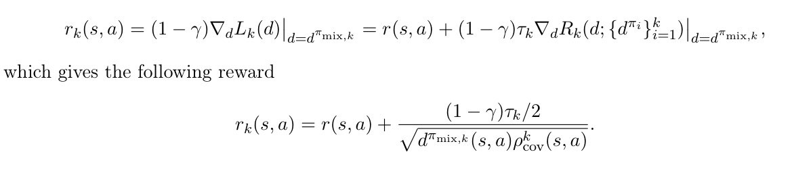

# Made: Exploration via maximizing deviation from explored regions

## 摘要

在奖励稀疏的高维环境中，有效的探索仍然是具有挑战性的。低维环境中通常表格参数化是可行的，基于计数的上置信度（UCB）探索方法实现了接近最优的最小速率。然而，如何在涉及非线性函数近似的RL任务中有效使用UCB仍然不够清楚。为了解决这个问题，文中提出了一种新的探索方法，通过最大化下一个策略与已探索区域的占用偏差。文中将这个偏差作为自适应正则器添加到标准RL的目标函数中，以平衡探索与利用。文中将新的目标与可证明的收敛算法进行配对，从而产生调整现有奖励的新内在奖励。所提出的内在奖励易于实现，并与其他现有强化学习算法相结合进行探索。作为概念的验证，文中在各种基于模型和无模型算法的表格示例上评估了新的内在奖励，显示了比仅计数策略探索的改进。

## 引言

在线强化学习是智能体学习如何执行任务的有效工具，尤其是在无先验知识（专家示范操作）的情况下，需要使用奖励信息来代替。为了学习一个令人满意的策略，智能体需要有效的平衡探索和利用。在奖励稀疏的环境中探索尤其具有挑战性，一种流行的探索方式是基于内在动机的，通过内在奖励来补充环境提供的外在奖励。在可证明的探索方法中，奖励往往可以捕捉到价值估计的不确定性，智能体采取的行动是最大限度的提高上置信区间。

在表格式的环境中，UCB奖励的构造方式通常是基于Hoeffding不等式，它仅使用访问量计数。或者Bernstein不等式，它除了使用访问次数以外，还使用了价值函数方差。在奖励有界的琴科给下，后者被证明是接近最优的。

如何在非线性函数中有效的计算置信界限以构建UCB奖励近似仍然是一个开放的问题。此外，Bernstein不等式中的奖励往往难以在实践中计算出来。这是因为在表格设置方面存在困难。由于计算价值函数方差的困难，Bernstein式的奖励在实践中往往很难计算。

实践中，人们提出了歌声中方法来设计内在奖励：访问伪计数奖励使用函数近似估计基于计数的UCB奖励，基于好奇心的奖励寻求模型预测误差高的状态，基于不确定性的奖励采用网络集合来估计Q函数的方差，基于赋权的方法将智能体引导至智能体控制的状态，并根据状态-行动对和下一个状态之间的信息增益来奖励智能体。

尽管实际的内在奖励在某些领域表现良好，但是从经验上来看，它们存在着诸如脱离、脱轨和灾难性的遗忘等问题。此外，这些方法通常缺乏明确的目标，可能陷入局部最优。事实上，目前一些深度强化学习算法所取得的令人深刻的表现通常围绕着手动设计密集奖励、利用大量领域知识的复杂探索策略或者在已知的环境下运行。

针对当前的实际挑战和理论与实践之间的差距，文中提出了一种基于最大偏离被探索区域的新算法。这是一种具有较强经验性能的使用算法，具体来说，算法包含了以下贡献：

1. 偏差最大化式的探索

   算法使用的方式是基于修改标准的RL算法的目标（即累积奖励），通过添加一个在迭代中自适应变化的正则化器。正则化器是一个基于状态-动作访问密度和先前状态-动作覆盖的一般函数。然后我们选择一个特定的正则化器来是最大化下一个策略访问$d_\pi$与前一个策略覆盖的区域$\rho_{cov}^{k}$的偏差:
   $$
   L_{k}(d_{\pi})=J(d_{\pi})+\tau_{k}\sum_{s,a}{\sqrt{\frac{d_{\pi}(s,a)}{\rho_{cov}^{k}(s,a)}}}
   $$
   其中，$k$表示迭代次数，$J(d_{\pi})$是标准的RL损失函数，当$\rho_{cov}^{k}(s,a)$很小时，正则化器使得$d_{\pi}(s,a)$变得很大。文中给出了一种求解正则化目标的算法，并证明其在获得近似规划oracle的情况下收敛到全局最优。文中的实证研究表明该式子产生的内在奖励可以添加到任何强化学习算法中以提高性能。此外，内在奖励对UCB风格的奖励进行了简单修改，考虑了之前的访问次数。这个简单的修改也可以添加到现有的奖励实践中。

2. 表格的研究

   在表格参数化的特殊情况下，文中表明该算法仅对Hoeffding风格的基于计数的奖励应用一些简单的调整。文中比较了在三种不同的算法中，对于stochastic diabolical bidirectional lock的探索任务（该环境是一个具有稀疏奖励以及局部最优的环境），该算法(MADE)与Hoeffding以及Bernstein奖励的性能。结果表明在这三种算法中，MADE相比Hoeffding都有显著的提高，并且与Bernstein奖励具有竞争力。在没有计算或估计方差的情况下，MADE奖励和探索策略似乎与Bernstein非常接近，这表明MADE潜在的捕捉了一些环境结构。且根据经验表明，MADE正则化器可以提高策略梯度算法的优化率。

3. MiniGrid和DeepMind控制套件的实验

   文中的经验表明，当与无模型、RAD以及基于模型的RL算法结合使用时，MADE可以很好的工作，大大提高了现有基线的样本效率。当在程序生成的MiniGrid环境中进行测试时，与最先进的方法BeBold相比，MADE收集到了2到5倍的样本。在DeepMind Control suite中，文中建立在无模型方法RAD和基于模型的方法Dream的基础上，相比baseline，在500K步中将回报率提高到了150。

## 背景

本节主要介绍了马尔科夫决策过程，以及如何将策略与其对应，在线强化学习的内容等。略

## RL目标的自适应正则化

### 正则化引导探索

在online RL中，智能体在每个状态下都面临两难：是应该选择一个看似最优的策略(利用)，还是应该探索MDP的不同区域。为了在探索和利用之间进行灵活的选择和权衡，文中提出在标准RL目标中添加一个正则化器，该目标在online RL算法的整个迭代过程中都会发生变化:
$$
L_k(d_{\pi})=J(d_{\pi})+\tau_{k}R(d_{\pi};{\{d_{\pi_{i}}}\}_{i=1}^{k})
$$
其中，$R(d_{\pi};{\{d_{\pi_{i}}}\}_{i=1}^{k}$是策略$\pi$以及先前策略$\pi_1...\pi_k$的状态-行为访问的函数。温度参数$\tau_k$决定了正则化的强度。上述公式是一个总体的目标函数，因为它不涉及受到样本收集随机性影响的经验估计。

### 通过最大限度的偏离策略范围进行探索

作者根据一个简单的直觉制定了探索策略：最大化与已探索区域的偏差，已探索区域即先前策略所访问的所有状态和行为。定义第$k$次迭代时的策略覆盖率为策略$\pi_1,...,\pi_k$所探索区域上的密度。即${\rho_{cov}^{k}(s,a)}=\frac{1}{k}\sum_{i=1}^{k}{d_{\pi_i}(s,a)}$。然后设计了一个正则化鼓励器来鼓励$d_{\pi}$与$\rho_{cov}^{k}$不同:
$$
R(d_{\pi};{\{d_{\pi_{i}}}\}_{i=1}^{k})=\sum_{s,a}{\sqrt{\frac{d_{\pi}(s,a)}{\rho_{cov}^{k}(s,a)}}}
$$
易得，上述函数的最大值出现在$d_{\pi}(s,a)\propto \frac{1}{\rho_{cov}^{k}(s,a)}$时。

现在计算新的目标函数产生的奖励。首先，定义一个混合策略$\pi_{mix,k}$，其中包含了一个策略序列$(\pi_1,...,\pi_k)$以及权重$((1-\eta)^{k-1},(1-\eta)^{k-2}\eta,(1-\eta)^{k-3}\eta,...,\eta)$，其中$\eta>0$。设$d_{\pi_{mix,k}}$是策略$\pi_{mix,k}$的访问密度。计算第$k$次迭代时的总奖励，方法是在$d_{\pi_{mix,k}}$中取新的目标函数相对于$d_{\pi}$的梯度:

上述内在奖励是基于两个密度构建的:$\rho_{cov}^{k}$是过去访问频率的均匀组合，$\hat{d}_{\pi_{mix,k}}$是过去访问频率的几何组合。策略覆盖率$\rho_{cov}^{k}$与之前迭代中$(s,a)$对的访问计数有关，类似于基于计数的奖励或其近似值，例如RND。因此，对于适当的$\tau_k$选择，MADE的内在奖励随着访问量的增加而减少。

MADE的内在奖励同时也与$1/\sqrt{d_{\pi_{mix,k}}(s,a)}$成正比，可以看作是对基于计数奖励的修正。实际上，由于$\pi_{mix,k}$中的权重$k$的衰减，上述结构为先前访问的(s,a)提供了更高的奖励。实验结果表明，这种纠正可以鼓励智能体重新访问被遗忘的状态和行为来缓解稀疏奖励探索中的主要困难，即脱离和灾难性遗忘。

### 表格情况下的MADE内在奖励

在表格式的环境中，策略覆盖率的经验估计简单的设置为$\hat{\rho}_{cov}^{k}(s,a)=N_k(s,a)/N_k$，其中$N_k(s,a)$是状态(s,a)的访问次数，$N_k$是第$K$

次迭代时的总计数。因此，MADE只是通过混合频率的形式简单的修改了Hoeffding形式的奖励。

### 从正则化中引出一些流行的奖励方式

