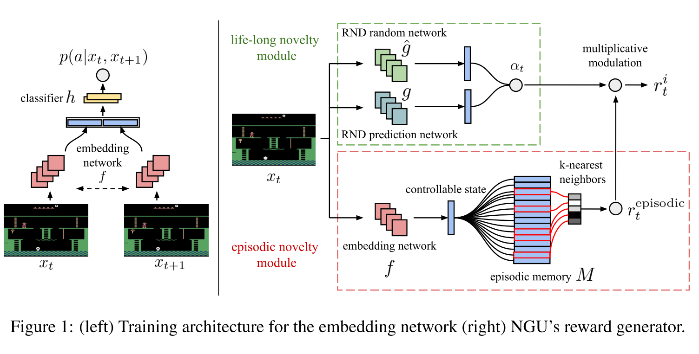

# NGU(Never Give Up):学习定向的探索策略

## 摘要

我们提出了一种强化学习代理来解决难度较高的探索类游戏，通过学习一系列定向探索策略。我们构建了一种基于情节记忆的内在奖励，利用最近经验中基于k最近邻的方法来训练定向探索策略，从而鼓励代理重复访问环境中的所有状态。我们使用自监督的逆向动力学模型来训练最近邻查找的嵌入，将新颖性信号偏向代理可以控制的方向。我们采用了通用值函数逼近器（UVFA）的框架，利用同一神经网络同时学习多个定向探索策略，这些策略在探索和利用之间具有不同的权衡。通过在不同的探索/利用程度上使用相同的神经网络，实现了从主要是探索性策略到有效的利用策略的迁移。所提出的方法可以与现代分布式强化学习代理结合使用，这些代理从许多并行运行在不同环境实例上的执行者收集大量经验。在Atari-57套件中，我们的方法将基础代理的性能提升了一倍，并在其他游戏中保持了非常高的得分，获得了中位数人类归一化得分为1344.0%。值得注意的是，所提出的方法是第一个在Pitfall!游戏中实现非零奖励（平均得分为8,400）而不使用示范或手工设计特征的算法。

## 引言

探索问题仍然是深度强化学习中的一个主要挑战。一般而言，保证找到最优策略的方法要求对每个状态-动作对的访问次数接近无穷大。在有限步骤后变得贪婪的策略可能永远无法学会最优行动；它们可能会过早地收敛到次优策略，并且无法收集到所需的数据进行学习。确保所有状态-动作对无限次地被遇到是维持探索的一般问题。
解决这个问题的最简单方法是考虑具有非零概率在每个状态下选择所有动作的随机策略，例如ε-贪婪或Boltzmann探索。虽然这些技术在表格式设置中最终会学习到最优策略，但它们非常低效，所需的步骤随状态空间的大小呈指数增长。尽管存在这些缺点，它们在稠密奖励场景中表现出色。然而，在稀疏奖励设置中，它们可能完全无法学习，因为时序扩展探索（也称为深度探索）对于找到极少数有奖励的状态至关重要）。

> 这段文字指出了保证找到最优策略所需的状态-动作对的访问次数接近无穷大的要求，并提到了贪婪策略可能过早收敛到次优策略、无法收集必要数据以及稀疏奖励设置下的挑战。它还提到了传统的探索方法在状态空间较大时效率低下的问题。总的来说，这段文字强调了探索问题的复杂性和对于收敛到最优策略的挑战。

最近的方法提出了为代理提供内在奖励以推动探索，重点是在非表格设置中展示性能。这些内在奖励与当前状态与已访问状态之间的差异程度相关联。当代理探索环境并熟悉环境时，探索奖励会消失，学习只受外在奖励驱动。这是一个合理的想法，因为目标是最大化外在奖励的期望总和。虽然在一些非常困难的探索任务上取得了非常好的结果，但这些算法面临一个根本性的限制：一旦状态的新奇性消失，代理不会再次访问该状态，而不考虑它可能提供的下游学习机会。其他方法则估计预测的前向模型，并使用预测误差作为内在动机。明确构建这样的模型，特别是从观察中构建模型，成本高昂，容易出错，并且很难推广到任意环境。在新奇性信号缺失的情况下，这些算法会降为无指导的探索方案，以非可扩展的方式进行探索。为了解决这个问题，需要仔细调整学习算法的速度和奖励消失的速度之间的平衡。

> 这段文字说明了最近的研究提出了一种基于内在奖励的方法来促进智能体的探索行为。这些内在奖励通常使用某种度量来衡量当前状态与已经访问状态之间的差异。然而，这些算法面临一个挑战，即一旦状态的新奇性消失，智能体就不再被鼓励再次访问该状态，即使该状态可能提供进一步的学习机会。另一些方法尝试通过建立预测模型并使用预测误差作为内在动机来解决这个问题。然而，明确构建这样的模型通常很昂贵、容易出错，并且难以推广到不同的环境中。在新奇性信号缺失的情况下，这些算法往往无法进行有效的探索。因此，需要仔细调整学习算法的速度和奖励消失的速度之间的平衡，以克服这个问题。

我们提出的方法的主要思想是从同一个网络中联合学习独立的探索策略和利用策略，以使利用策略专注于最大化外在奖励（解决当前任务），而探索策略可以在不降为无向策略的情况下保持探索行为。我们提议通过UVFA框架参数化一组策略，并学习具有不同探索行为程度的策略。探索策略的学习可以看作是一组辅助任务，可以帮助构建一个共享的架构，即使在没有外在奖励的情况下，该架构仍然可以不断发展。我们使用强化学习来逼近对应于多个内在奖励权重的最优值函数。

> 当采用文中提出的方法时，智能体将同时学习探索策略和利用策略，通过共享网络架构来实现。这里给出一个简化的示例，说明文中方法的工作方式：
>
> 假设我们有一个智能体在一个迷宫环境中进行学习，目标是找到迷宫的出口。智能体使用深度Q网络（DQN）和随机网络蒸馏（RND）算法进行训练。
>
> 1. 初始阶段：
>    - 在初始阶段，智能体的探索策略和利用策略是相同的，都是随机的。
>    - 智能体根据外在奖励（例如，每次到达迷宫出口时获得的正奖励）和内在奖励（根据RND算法计算的奖励）进行训练。
>
> 2. 联合学习：
>    - 智能体使用UVFA框架，在同一个神经网络中联合学习多个策略。例如，联合学习探索与利用策略。通过多头神经网络来在同一个网络输出探索策略的输出和利用策略的输出。并通过其他的方式（例如概率因子，从多个输出中挑选一个输出）
>    - 神经网络的参数可以调整，以实现不同探索行为程度的策略。例如，可以通过增加探索因子来增强探索行为。
>
> 3. 辅助任务：
>    - 探索策略被视为一个辅助任务，通过学习这个任务可以帮助构建共享的网络架构。
>    - 在没有外在奖励的情况下，通过探索策略继续进行学习，可以提供更多的探索机会，并为后续的利用策略提供更好的学习基础。
>
> 4. 奖励调整：
>    - 随着智能体在环境中的探索，内在奖励的权重逐渐减小，外在奖励的权重逐渐增加。
>    - 这种调整确保在学习过程中逐渐从探索向利用的转变，并且智能体可以集中于最大化外在奖励。
>
> 通过上述步骤，智能体可以在探索和利用之间找到一个平衡，并逐渐优化其行为以获得最大的奖励。这种方法能够克服传统探索方法在稀疏奖励设置下效率低下的问题，并提供更灵活和综合的训练方式。

我们提出了一种内在奖励机制，将每个回合和终身的新颖性结合起来，明确地鼓励智能体在一个回合内反复访问环境中的所有可控状态。回合新颖性鼓励智能体在多个回合中定期重访熟悉（但可能没有完全探索）的状态，但不会在同一个回合内进行重访。终身新颖性逐渐减少在许多回合中逐渐熟悉的状态的影响。我们的回合新颖性使用一个回合内存，其中包含所有先前访问过的状态，使用 Pathak等人的自监督目标进行编码，以避免无法控制的状态空间的影响。回合新颖性定义为当前状态与先前存储的状态的相似性。这使得回合新颖性能够在一个回合内快速适应：智能体进行的每次观察都可能显著改变回合新颖性。我们的终身新颖性通过随机网络蒸馏误差驱动，并以乘法方式调制回合相似性信号，与回合新颖性不同，终身新颖性变化缓慢，依赖梯度下降优化（而不是回合新颖性的内存写入）。因此，这种结合的新颖性概念能够在具有大型、高维状态空间的复杂任务中进行泛化，其中一个给定的状态不会被观察两次，并能够在一个回合内和多个回合之间保持一致的探索。

> 这段文字主要介绍了两种新颖性概念的作用。其中，回合新颖性鼓励智能体在一个回合内反复探索不完全熟悉的状态，从而减少在同一回合中访问相同状态的频率。而终身新颖性则是针对整个训练过程，它衡量状态的整体新颖性，并逐渐减少已经熟悉的状态的影响。通过结合这两种新颖性概念，智能体能够在复杂任务中进行泛化，保持一致的探索行为，同时在回合内和跨回合中都能有效地探索环境。

> NGU（Novelty-Driven Exploration）是一种基于新颖性驱动的探索方法，其工作原理如下：
>
> 1. 卷积神经网络（CNN）特征提取：首先，将输入图片通过卷积神经网络进行卷积操作，提取出状态特征。这些特征用于表示环境状态的相关信息。
>
> 2. 回合新颖性记忆缓存：NGU中包含了一个回合新颖性的记忆缓存，用于存储之前访问过的状态特征。
>
> 3. 挑选最接近的状态特征：从回合新颖性记忆缓存中，根据当前的状态特征选择K个与当前状态特征最接近的之前访问过的状态特征。这些最接近的状态特征可以作为参考，用于评估当前状态的新颖性。
>
> 4. 误差期望作为奖励：针对选取的K个最接近的状态特征，计算它们与当前状态特征之间的误差的期望。这个误差的期望可以作为奖励的一部分提供给智能体，用于驱动智能体的探索行为。较高的误差期望表示当前状态与之前访问过的状态有较大差异，可能代表新的、未探索的状态，因此提供更大的奖励以鼓励智能体探索。
>
> 总的来说，NGU通过利用回合新颖性的记忆缓存和计算误差期望作为奖励，来驱动智能体在环境中进行探索。通过提供对于新颖状态的较高奖励，NGU可以帮助智能体更好地探索未知领域，从而提高其在复杂任务中的性能表现。

## 永不放弃的内在奖励

我们遵循了关于基于好奇心驱动的探索的文献，其中外部奖励会受到内在奖励（或探索奖励）的增强。增强后的奖励在$t$时刻被定义为$r_t=r_t^e+\beta r_t^i$，其中$r_t^e$和$r_t^i$分别是外部奖励和内在奖励，$\beta$则是一个标量，用于加强后者的相关性。深度强化学习智能体通常在增强奖励$r_t$上进行训练，而仅使用外部奖励$r_e^t$来衡量性能。

我们的内在奖励$r_t^i$满足三个属性:

1. 它会迅速阻止在同一回合内重复访问相同的状态
2. 它会逐渐阻止在多个回合内访问过多次的状态
3. 状态的概念忽略了在环境中不受智能体影响的部分

我们首先提供了提出的内在奖励计算的总体概述。然后，我们提供了每个组成部分的详细信息。奖励由两个模块组成：一个回合新颖性模块和一个（可选的）终身新颖性模块，分别在Figure 1（右）中用红色和绿色表示。

回合新颖性模块计算我们的回合内在奖励，由一个回合内存M和一个嵌入函数$f$组成，将当前观察映射到一个我们称之为可控状态的学习表示。每个回合开始时，回合内存完全为空。在每一步，智能体计算一个回合内在奖励$r_{t}^{episodic}$，并将对应于当前观察的可控状态附加到内存$M$中。为了确定奖励加成，当前观察与回合内存的内容进行比较。较大的差异会产生较大的回合内在奖励。回合内在奖励$r_{t}^{episodic}$励智能体在单个回合内访问尽可能多的不同状态。

这意味着新颖性的概念忽略了回合间的交互：一个被访问了数千次的状态与一个全新的状态给出相同的内在奖励，只要它们在当前回合的历史中同样新颖。

> 上述这段红色文字其实说明的是回合新颖性的缺陷，也就是说，如果单纯的使用回合新颖性作为探索奖励给予智能体。那么就会陷入一个问题，即使一个状态在过去的回合中被访问了上千次，只要它在当前回合内没有被访问过，那么通过回合新颖性给出的探索奖励将和那些真正需要探索、在历史回合中都很少甚至没有被访问过的状态的探索奖励相同。
>
> 也正是因为需要解决这样的问题，所以NGU中包含了终身新颖性的模块。对于那些历史访问过多次的状态，给予的内在奖励会逐渐减少。

一个终身（或跨回合）新颖性模块提供了一个长期的新颖性信号，用于在回合之间有状态地控制探索的程度。我们通过将探索奖励$r_{t}^{episodic}$与一个终身好奇心因子$\alpha_t$相乘来实现这一点。需要注意的是，这种调制会随着时间的推移逐渐消失，将我们的方法简化为使用非调制奖励。具体而言，我们按照以下方式将$\alpha_t$与$r_{t}^{episodic}$结合起来（也参见图1（右））：
$$
r_t^i=r_t^{episodic}*\min\{\max{\{\alpha_t,1\}},L\}
$$
其中，$L$是一个可选择的最大奖励比例(论文中所有的实验采用的$L$均为5)，通过这样的方式混合奖励。我们利用了$\alpha_t$提供的长期新颖性检测，同时$r_{i}^{t}$继续鼓励我们的智能体探索所有可控制的状态。

### 嵌入网络(Embedding network)

> Embedding network是一种神经网络结构，用于将输入数据映射到一个低维表示空间中的向量表示，也被称为嵌入空间。这个向量表示捕捉了输入数据的关键特征，并且在嵌入空间中相似的数据点在向量空间中也更加接近。
>
> Embedding network通常由多个层组成，包括输入层、隐藏层和输出层。它可以是一个预训练好的网络，如预训练的卷积神经网络（CNN）或循环神经网络（RNN），也可以是从头开始训练的网络。
>
> Embedding network的目标是学习一个函数，将输入数据映射到嵌入空间中的向量表示。这个向量表示具有以下特点：
>
> 1. 维度较低：嵌入向量通常具有较低的维度，以便更好地表示输入数据的关键特征。
>
> 2. 语义相关性：在嵌入空间中，相似的输入数据点在向量空间中也更加接近。例如，在图像嵌入空间中，具有相似内容的图像在向量空间中的距离较近。
>
> 3. 可解释性：嵌入向量的每个维度通常与输入数据的某种特征或概念相关联，使得可以解释向量中每个维度的含义。
>
> Embedding network广泛应用于各种机器学习任务，如图像识别、自然语言处理和推荐系统等，用于提取输入数据的有意义的表示，从而改善模型的性能和泛化能力。

$f:\mathcal{O}\rightarrow \Bbb{R}^p$将当前观测映射到与其可控状态对应的$p$维向量，考虑一个具有独立于智能体行为的许多可变性的环境，例如一个行人与交通工具四处横行的城市。智能体可以在不做任何动作的情况下访问到大量不同的状态（收集大量的累积内在奖励）。这样不会给智能体带来任何有意义的探索。为了避免这样无意义的探索，在给定了连续两个观测值的情况下，我们训练了一个孪生网络(Siamese network)$\quad f$ 来预测智能体从一个观测转移到另一个观测所使用的行为。直观的说，对于环境中任何不由智能体动作产生的变异性来使用这样的预测是无效的。更加正式的说，给定一个三元组${s_t,a_t,s_{t+1}}$表示两个连续的观测，其中$s_t、s_{t+1}$表示状态，$a_t$表示采取的动作，我们将条件概率参数化为$p(a|s_t,s_{t+1})=h(f(s_t),f(s_{t+1}))$，其中$h$是一个包含一个隐藏层的多层感知机（MLP），后面跟随一个softmax操作。$h$和$f$的参数都通过最大似然估计进行训练。这种架构可以看作是一个带有一层分类器的孪生网络，如Figure 1左所示。

> 这段文字说明了在一个环境中，智能体面临许多与其行为无关的变异性，例如一个城市中行人和交通工具的变化。如果智能体可以在不采取任何行动的情况下访问到大量不同的状态，那么这种探索是没有意义的。为了避免这种无意义的探索，作者采用了一个孪生网络（Siamese network）来预测智能体从一个观测转移到另一个观测所采取的行为。这个网络通过学习智能体的行为模式来预测行为，并且忽略了环境中与智能体行为无关的变异性。具体地，作者使用一个多层感知机（MLP）作为分类器来建模条件概率，其中隐藏层的输入是通过将观测映射到一个$p$维向量的映射函数$f$得到的。通过最大似然估计来训练这个网络的参数，以使其能够准确地预测智能体的行为。整个架构可以看作是一个带有分类器的孪生网络。

每个回合的回合记忆缓存$M$是一个基于回合大小而变化的动态大小的记忆缓存，以在线的方式存储可控状态。在时间步$t$时，记忆缓存中包含当前episode中所访问的所有观测的可控状态，即$\{f(s_0),f(s_1),...f(s_{t-1})\}$。经由具有理论证明的将状态-行为计数转换为奖励加成的方法的启发，我们的内在奖励被定义为:
$$
r_t^{episodic}=\frac{1}{\sqrt{n(f(s_t))}}\approx\frac{1}{\sqrt{\sum_{f_i\in N_k}{K(f(s_t),f_i)}}+c}
$$

其中，$n(f(s_t))$表示对于一个抽象状态$f(s_t)$的访问次数。我们将这个计数$n(f(s_t))$使用核函数$K:\Bbb R^p *\Bbb R^p \rightarrow \Bbb R$在记忆缓存$M$上给出的相似度之和来进行估计。在实践中，伪计数是使用记忆缓存中$M$中$f(s_t)$的$k$个最近邻来计算的，使用$N_k=\{f_i\}_{i=1}^k$来表示。而常数$c$则保证了"伪计数"的最小数量(在论文的实验中固定为0.001)。值得注意的是，当$K$是一个狄拉克函数时，近似变得非常精确，但是也因此没有提供对于非常大的状态空间所需要的一般性探索。根据Blundell et al. (2016); Pritzel et al. (2017)，我们使用$K$的逆核函数:
$$
K(x,y)=\frac{\epsilon}{\frac{d^2(x,y)}{d^2m}+\epsilon}
$$
其中，$\epsilon$是一个很小的常量(论文的实验中固定为0.001)，$d$表示欧氏距离，而$d^2_m$则是$k$个最近邻的欧式距离的平方值之和的平均值。由于不同的任务学习到的特征之间可能有不同的典型距离，因此使用这个运行平均值可以使得内在奖励的计算更加稳健。

> 为什么公式中的状态计数$n(f(s_t))$需要取根号？
>
> 在公式中，将$n(f(s_t))$取根号是为了对可控状态的数量进行标准化，以控制内在奖励的大小范围。
>
> 根据公式，$n(f(s_t))$表示与当前状态$f(s_t)$相似的可控状态的数量。如果不进行根号操作，那么内在奖励的值将与可控状态的数量成正比，可能会导致内在奖励的值过大或过小。
>
> 通过对$n(f(s_t))$取根号，可以使得内在奖励的大小与可控状态的数量的平方根成反比。这样做的目的是平衡内在奖励的大小，并确保内在奖励在不同场景下具有适当的尺度，更好地用于驱动探索行为。
>
>  
>
> 什么是核函数？
>
> 核函数是一种用于非线性特征映射的数学函数。在机器学习和模式识别中，核函数通常用于将数据从原始特征空间映射到一个高维的特征空间，使得在高维空间中的数据线性可分或更易于处理。核函数的主要作用是通过计算两个样本之间的相似度或距离来进行特征变换。
>
> 核函数具有一个重要的性质，即通过核函数计算的内积在原始特征空间中与在高维特征空间中的映射后计算的内积是一致的。这意味着可以直接在原始特征空间中计算核函数的内积，而无需显式地进行特征映射。
>
> 常见的核函数包括线性核函数、多项式核函数、高斯核函数等。不同的核函数适用于不同类型的数据和问题。核函数在支持向量机（SVM）、核主成分分析（KPCA）等算法中广泛应用，并且在非线性问题的建模和分类中具有重要作用。
>
> 简而言之，核函数的作用就是将向量映射到更高维的空间，而不改变其特征。向量之间在本身所在的空间中也许不是线性可分的，然而到了更加高维可能会线性可分。更便于计算向量之间的距离等参数。
>
>  什么是狄拉克函数？为什么$k$是一个狄拉克函数时，近似会变得非常精确？
>
> 狄拉克函数（Dirac function），也称为单位脉冲函数，是一种在数学和物理学中常用的特殊函数。它以物理学家保罗·狄拉克（Paul Dirac）的名字命名。
>
> 狄拉克函数通常用符号δ(x)表示，其中x是实数变量。狄拉克函数在除了原点x=0以外的所有点处都为零，而在原点x=0处则具有无穷大的幅度，但积分结果却等于1。这使得狄拉克函数在表示集中力或冲击的物理现象时非常有用。
>
> 数学上，狄拉克函数可以通过广义函数的理论进行定义和处理。它在物理学中的应用非常广泛，例如在量子力学中描述粒子位置的波函数、在信号处理中表示脉冲信号、在电路理论中描述电荷分布等。
>
> 
>
> 为什么$k$是一个狄拉克函数时，近似会变得非常精确？这是因为狄拉克函数在某一点的取值为无穷大，而在其他点的取值为零。当使用狄拉克函数作为核函数时，计算伪计数时只有最近邻中与当前状态特征完全匹配的样本才会对伪计数有贡献，其他样本的贡献为零。
>
> 假设当前状态特征为$f(s_t)$，记忆缓存中的最近邻样本集合为$N_k=\{f_i\}$，其中$f_i$是记忆缓存中的样本特征。当核函数K是狄拉克函数时，只有当$f_i$与$f(s_t)$完全匹配时，$K(f_i, f(s_t))$的取值才会为无穷大，其他样本的K值均为零。因此，伪计数只有在最近邻中与$f(s_t)$完全匹配的样本上才会有贡献，而其他样本的贡献为零。
>
> 这种情况下，伪计数的近似结果会非常精确，因为它只考虑了与当前状态特征完全匹配的样本，忽略了其他样本。这种精确性在某些情况下可能是有益的，特别是当需要对状态空间中的特定状态进行精细探索时。
>
> 然而，需要注意的是，狄拉克函数作为核函数的精确性也带来了一定的局限性，即只对与当前状态特征完全匹配的样本进行估计。对于状态空间非常大或连续的情况，仅依赖于狄拉克函数可能无法提供足够的一般性探索。因此，在实际应用中，可能需要考虑使用其他核函数来平衡精确性和一般性之间的权衡。
>
> 什么是逆核函数？
>
> 逆核函数（Inverse Kernel）是一种用于度量样本之间相似度或距离的函数。与传统的核函数不同，逆核函数主要用于衡量两个样本之间的相异程度，而不是相似程度。
>
> 通常情况下，核函数用于衡量两个样本在一个高维特征空间中的相似性，它将样本映射到一个更高维的空间，并计算它们在该空间中的内积或相似度。而逆核函数则用于度量样本之间的差异或距离，它衡量两个样本在特征空间中的远近程度。
>
> 逆核函数可以采用不同的形式和度量方式，例如欧氏距离、曼哈顿距离、余弦相似度等。它们根据具体的应用和问题需求选择合适的度量方式，以便评估样本之间的差异程度。
>
> 在机器学习和数据挖掘中，逆核函数常用于聚类、异常检测、相似性搜索等任务中，通过计算样本之间的差异程度来判断它们之间的相似性或相关性。逆核函数的选择和定义需要根据具体问题的特点和数据的特征来确定，以便提取出有效的信息和模式。
>
> 而在本文中，根据逆核函数的概念。在智能体探索到了新的状态时，逆核函数通过将其与记忆缓存中的样本计算欧式距离时会得到一个较大的值，这个值就是我们的内在奖励。而当我们来到旧的状态时，则会逐渐减少内在奖励。

### 整合终身好奇心（新颖性）模块

原则上来说，任何长期的新颖性估计器都可以作为调节好奇心因子$\alpha_{t}$的基础。我们发现RND的工作良好，易于实现且易于并行化。RND的好奇心因子$\alpha_{t}$的定义如下:引入一个随机、未经训练的卷积网络$g:\mathcal{O}\rightarrow \Bbb R^k$，该网络试图预测在训练过程中观测到的所有观测的$g$的输出，并通过最小化损失函数$err(s_t)=||\hat{g}{(s_t;\theta)-g(s_t)}||^2$的$\theta$参数的方式来逼近真实的$g(s_t)$。然后，将$\alpha_{t}$定义为归一化的均方误差:
$$
\alpha_{t}=1+\frac{err(s_t)-\mu_{e}}{\sigma_{e}}
$$
其中，$\sigma_{e}、\mu_{e}$分别是$err(s_t)$的运行时标准差和均差。